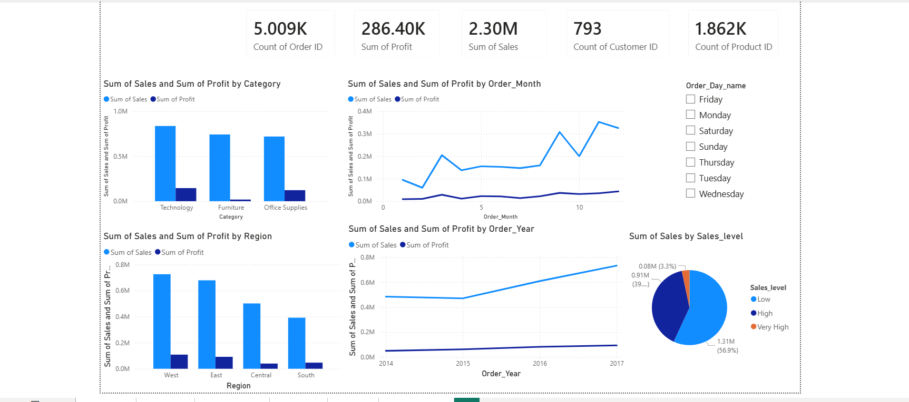

# Sales and Profit Analysis Dashboard

An interactive Power BI dashboard created to analyze sales, profit, orders, customers, products, categories, regions, and sales trends.

## Dashboard Preview

## Project Overview

This project presents an interactive sales and profit analysis dashboard. It provides a clear overview of business performance and helps identify high-performing categories, regions, months, years, and sales levels.

The dashboard allows users to analyze data using different business dimensions, including:

- Product category
- Region
- Order month
- Order year
- Sales level
- Order day
- Customer data
- Product data

## Key Performance Indicators

| Metric | Value |
|---|---:|
| Total Orders | 5.009K |
| Total Profit | 286.40K |
| Total Sales | 2.30M |
| Total Customers | 793 |
| Total Products | 1.862K |

## Dashboard Visualizations

### Sales and Profit by Category

This visual compares sales and profit across the following categories:

- Technology
- Furniture
- Office Supplies

Technology is the highest-performing category in terms of both sales and profit.

### Sales and Profit by Region

This visual compares business performance across:

- West
- East
- Central
- South

The West region generates the highest sales and profit, followed by the East region.

### Sales and Profit by Month

The monthly trend chart displays changes in sales and profit throughout the year. It helps identify high-performing and low-performing months.

### Sales and Profit by Year

The yearly trend chart shows sales and profit performance from 2014 to 2017. Sales increased significantly by 2017, while profit also showed steady growth.

### Sales by Sales Level

The sales-level chart divides sales into three groups:

- Low
- High
- Very High

The Low sales level contributes the largest share of total sales.

### Order Day Filter

The dashboard includes an order-day filter that allows users to analyze performance by:

- Monday
- Tuesday
- Wednesday
- Thursday
- Friday
- Saturday
- Sunday

## Key Insights

- Technology is the top-performing product category.
- The West region has the highest sales and profit.
- Total sales are approximately 2.30M.
- Total profit is approximately 286.40K.
- The number of orders is approximately 5.009K.
- The dashboard contains 793 customers and 1.862K products.
- Sales increased between 2014 and 2017.
- Low-level sales transactions represent the largest portion of total sales.
- Interactive filters make it possible to analyze performance by order day.

## Business Questions Answered

This dashboard helps answer the following questions:

- What are the total sales and profit?
- Which category has the highest sales?
- Which category generates the highest profit?
- Which region performs best?
- How do sales and profit change by month?
- What is the yearly sales trend?
- Which sales level contributes the most revenue?
- How many orders, customers, and products are included in the data?
- How does business performance change according to the order day?

## Tools and Technologies

- Power BI
- Data visualization
- Data analysis
- KPI analysis
- Interactive dashboards
- Charts and slicers

## Project Workflow

1. Imported the sales dataset into Power BI.
2. Cleaned and transformed the data.
3. Created calculated measures for sales, profit, orders, customers, and products.
4. Designed KPI cards.
5. Created charts for category, region, month, year, and sales-level analysis.
6. Added an order-day slicer for interactive filtering.
7. Designed the final dashboard for business reporting.

## Future Improvements

- Add profit-margin analysis.
- Add customer-segment analysis.
- Add product-level drill-downs.
- Add year-over-year growth calculations.
- Add monthly sales and profit comparisons.
- Add a detailed transaction-level table.
- Add geographical map visualizations.
- Connect the dashboard to a live data source.

## Conclusion

This Sales and Profit Analysis Dashboard converts raw sales data into meaningful business insights. It helps users understand sales performance, profit trends, category performance, regional performance, and yearly growth through interactive Power BI visualizations.
# Sales and Profit Analysis Dashboard

An interactive Power BI dashboard created to analyze sales, profit, orders, customers, products, categories, regions, and sales trends.

## Dashboard Preview

## Project Overview

This project presents an interactive sales and profit analysis dashboard. It provides a clear overview of business performance and helps identify high-performing categories, regions, months, years, and sales levels.

The dashboard allows users to analyze data using different business dimensions, including:

- Product category
- Region
- Order month
- Order year
- Sales level
- Order day
- Customer data
- Product data

## Key Performance Indicators

| Metric | Value |
|---|---:|
| Total Orders | 5.009K |
| Total Profit | 286.40K |
| Total Sales | 2.30M |
| Total Customers | 793 |
| Total Products | 1.862K |

## Dashboard Visualizations

### Sales and Profit by Category

This visual compares sales and profit across the following categories:

- Technology
- Furniture
- Office Supplies

Technology is the highest-performing category in terms of both sales and profit.

### Sales and Profit by Region

This visual compares business performance across:

- West
- East
- Central
- South

The West region generates the highest sales and profit, followed by the East region.

### Sales and Profit by Month

The monthly trend chart displays changes in sales and profit throughout the year. It helps identify high-performing and low-performing months.

### Sales and Profit by Year

The yearly trend chart shows sales and profit performance from 2014 to 2017. Sales increased significantly by 2017, while profit also showed steady growth.

### Sales by Sales Level

The sales-level chart divides sales into three groups:

- Low
- High
- Very High

The Low sales level contributes the largest share of total sales.

### Order Day Filter

The dashboard includes an order-day filter that allows users to analyze performance by:

- Monday
- Tuesday
- Wednesday
- Thursday
- Friday
- Saturday
- Sunday

## Key Insights

- Technology is the top-performing product category.
- The West region has the highest sales and profit.
- Total sales are approximately 2.30M.
- Total profit is approximately 286.40K.
- The number of orders is approximately 5.009K.
- The dashboard contains 793 customers and 1.862K products.
- Sales increased between 2014 and 2017.
- Low-level sales transactions represent the largest portion of total sales.
- Interactive filters make it possible to analyze performance by order day.

## Business Questions Answered

This dashboard helps answer the following questions:

- What are the total sales and profit?
- Which category has the highest sales?
- Which category generates the highest profit?
- Which region performs best?
- How do sales and profit change by month?
- What is the yearly sales trend?
- Which sales level contributes the most revenue?
- How many orders, customers, and products are included in the data?
- How does business performance change according to the order day?

## Tools and Technologies

- Power BI
- Data visualization
- Data analysis
- KPI analysis
- Interactive dashboards
- Charts and slicers

## Project Workflow

1. Imported the sales dataset into Power BI.
2. Cleaned and transformed the data.
3. Created calculated measures for sales, profit, orders, customers, and products.
4. Designed KPI cards.
5. Created charts for category, region, month, year, and sales-level analysis.
6. Added an order-day slicer for interactive filtering.
7. Designed the final dashboard for business reporting.

## Future Improvements

- Add profit-margin analysis.
- Add customer-segment analysis.
- Add product-level drill-downs.
- Add year-over-year growth calculations.
- Add monthly sales and profit comparisons.
- Add a detailed transaction-level table.
- Add geographical map visualizations.
- Connect the dashboard to a live data source.

## Conclusion

This Sales and Profit Analysis Dashboard converts raw sales data into meaningful business insights. It helps users understand sales performance, profit trends, category performance, regional performance, and yearly growth through interactive Power BI visualizations.

## Author

**Arjun Kumar **

- LinkedIn: https://www.linkedin.com/in/arjun-kumar-3a5950204/
- GitHub: https://github.com/arjuninsights
